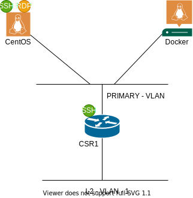

##########
Lab Access
##########

In this lab, you will have access to one (1) Linux VM. The Linux VM is configured to provide access to Docker and execute the scripts need during the Lab.

The lab topology is shown as below:

IP Addressing and Access Information
====================================

.. csv-table::
   :file: ./reference/devices-info.csv
   :width: 80%
   :header-rows: 1

.. Note ::

    Some information such as ``usernames`` and ``passwords`` may change, if so, it will be delivered to the attendees just at the beginning of the session.

Connecting to the Lab
=====================

Option 1 (preferred)
--------------------

Use the ``Cisco AnyConnect Secure Mobility Client`` to connect through a VPN, information will be provided at the beginning of the session.

.. csv-table::
   :file: ./reference/access-info.csv
   :width: 80%
   :header-rows: 1

Option 2
--------

Launch the Remote Desktop Client (different versions may use depending on OS) and login into the client with the following credentials:

- Username: ``cisco``
- Password: ``C1sc012345``

From Remote Desktop you can acccess network devices, Docker, GitHub repo and documentation. In addition you can create your enviroment to start to build your self service portal.

