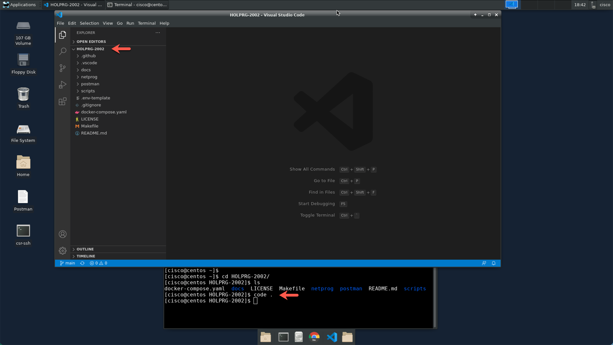
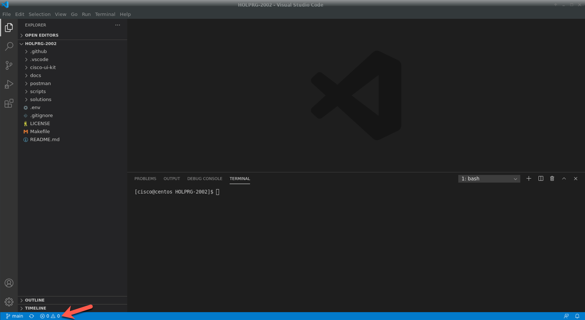

Step 2: Launch Visual Studio Code
#################################

For this session we recommend to use Visual Studio Code (VSC) as the Integrated Development Environment (IDE).
Visual Studio Code is installed in your POD, to open your repo **HOLPRG-2002**, follow these instructions:

1- From your terminal within repo directory :guilabel:`HOLPRG-2002` run the following command:

.. code-block:: bash

    code .

Once Visual Studio Code is open, we recommend using the integrate terminal.
To launch it, click the icons as shown on the following screenshot.

You can use Visual Studio Code's integrated terminal instead of an external terminal.

.. sectionauthor:: Luis Rueda <lurueda@cisco.com>, Jairo Leon <jaileon@cisco.com>, Ovesnel Mas Lara <omaslara@cisco.com>
