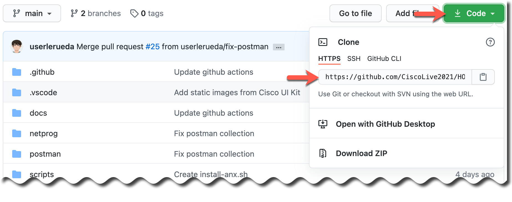

Step 2: Clone Repository
########################

To clone the repository floww the instrucctions bellow:

1- Go to following URL `HOLPRG-2002 <https://github.com/CiscoLive2021/HOLPRG-2002>`__

2- Copy the repo's URL:

.. code-block:: bash

    https://github.com/CiscoLive2021/HOLPRG-2002.git

3- Open a terminal and copy and issue the following command:

.. code-block:: bash

    git clone https://github.com/CiscoLive2021/HOLPRG-2002.git

4- Move to the local repo directory and verify that the repo has been cloned:

.. code-block::

    cd HOLPRG-2002

.. sectionauthor:: Luis Rueda <lurueda@cisco.com>, Jairo Leon <jaileon@cisco.com>, Ovesnel Mas Lara <omaslara@cisco.com>
