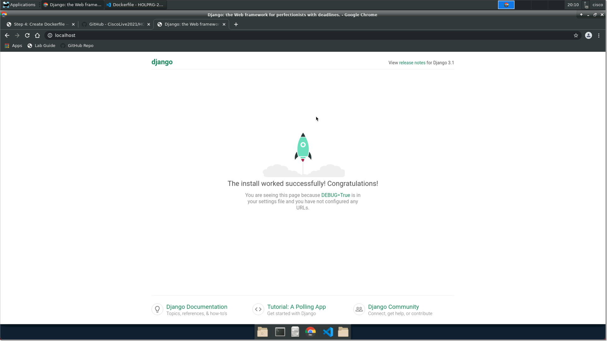

Step 5: Build and Run Our Application Container
###############################################

Now that our Dockerfile is ready, we will need to build and image using the Dockerfile, in order to do so execute the following command:

.. code-block:: bash

   docker build . -t holprg2002

The following is a sample output from the above command:

.. code-block::

   [cisco@centos HOLPRG-2002]$ docker build . -t holprg2002
   Sending build context to Docker daemon   21.7MB
   Step 1/6 : FROM python:3-slim-buster
   ---> b2b5367cdfd4
   Step 2/6 : WORKDIR /app
   ---> Running in 3824348cdccc
   Removing intermediate container 3824348cdccc
   ---> ffc346252616
   Step 3/6 : COPY requirements.txt .
   ---> 3954761e5349
   Step 4/6 : RUN pip install -r requirements.txt --no-cache-dir
   ---> Running in 6daeb0e7de3e
   Collecting Django==3.1.7
   Downloading Django-3.1.7-py3-none-any.whl (7.8 MB)
   Collecting requests==2.25.1
   Downloading requests-2.25.1-py2.py3-none-any.whl (61 kB)
   Collecting pytz
   Downloading pytz-2021.1-py2.py3-none-any.whl (510 kB)
   Collecting sqlparse>=0.2.2
   Downloading sqlparse-0.4.1-py3-none-any.whl (42 kB)
   Collecting asgiref<4,>=3.2.10
   Downloading asgiref-3.3.1-py3-none-any.whl (19 kB)
   Collecting idna<3,>=2.5
   Downloading idna-2.10-py2.py3-none-any.whl (58 kB)
   Collecting chardet<5,>=3.0.2
   Downloading chardet-4.0.0-py2.py3-none-any.whl (178 kB)
   Collecting urllib3<1.27,>=1.21.1
   Downloading urllib3-1.26.4-py2.py3-none-any.whl (153 kB)
   Collecting certifi>=2017.4.17
   Downloading certifi-2020.12.5-py2.py3-none-any.whl (147 kB)
   Installing collected packages: urllib3, sqlparse, pytz, idna, chardet, certifi, asgiref, requests, Django
   Successfully installed Django-3.1.7 asgiref-3.3.1 certifi-2020.12.5 chardet-4.0.0 idna-2.10 pytz-2021.1 requests-2.25.1 sqlparse-0.4.1 urllib3-1.26.4
   Removing intermediate container 6daeb0e7de3e
   ---> 4cdc330ed00e
   Step 5/6 : COPY ./netprog .
   ---> c299749182a2
   Step 6/6 : CMD ["python", "manage.py", "runserver", "0.0.0.0:80"]
   ---> Running in b5b265ecf055
   Removing intermediate container b5b265ecf055
   ---> c431419578ef
   Successfully built c431419578ef
   Successfully tagged holprg2002:latest

Now that we have a container image with our application, lets run the container with our application with the following command:

.. code-block:: bash

   docker run -it --rm -p 80:80 -v $PWD/netprog:/app -w /app holprg2002

After executing the above command you will see the application start and the server will be listening in port 80.
To stop the application and thus stop the container, press ``^C``.

.. code-block::

   [cisco@centos HOLPRG-2002]$ docker run -it --rm -p 80:80 -v $PWD/netprog:/app -w /app holprg2002
   Watching for file changes with StatReloader
   Performing system checks...

   System check identified no issues (0 silenced).

   You have 18 unapplied migration(s). Your project may not work properly until you apply the migrations for app(s): admin, auth, contenttypes, sessions.
   Run 'python manage.py migrate' to apply them.
   March 17, 2021 - 19:48:45
   Django version 3.1.7, using settings 'netprog.settings'
   Starting development server at http://0.0.0.0:80/
   Quit the server with CONTROL-C.

Open your browser and go to http://localhost and you should see the following page loaded:

Lets now stop our server by pressing ``^C``

.. sectionauthor:: Luis Rueda <lurueda@cisco.com>, Jairo Leon <jaileon@cisco.com>, Ovesnel Mas Lara <omaslara@cisco.com>
