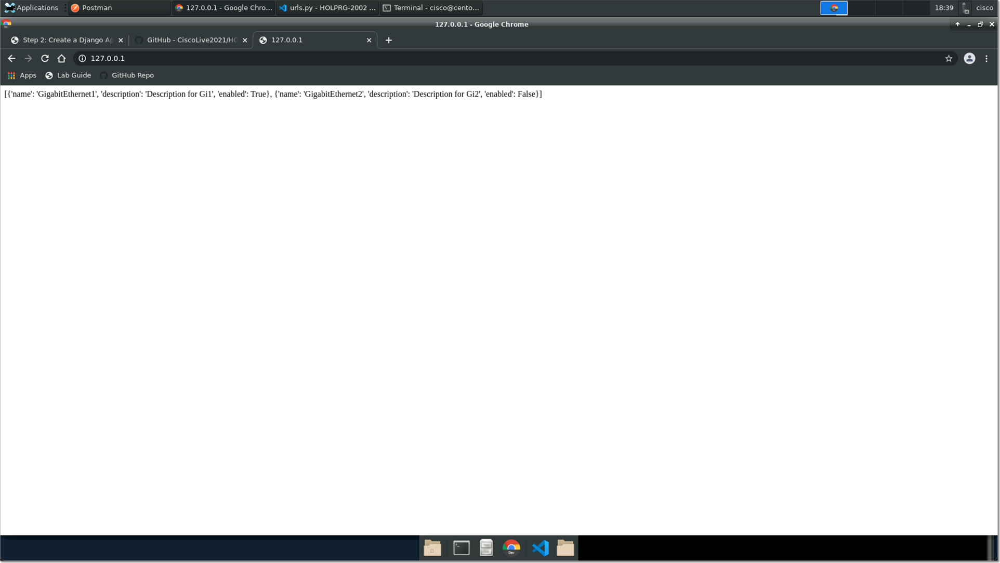

.. _t2s3:

Step 3: Create Interfaces View
##############################

Now that our application is ready, let's create a Django view for it.
The view, allows us to produce HTML code that will be presented to the user when they open the browser for our project.

Let's start by modifying the :guilabel:`netprog/interfaces/views.py` file and adding the following code:

.. code-block:: python
    :caption: netprog/interfaces/views.py
    :linenos:
    :emphasize-lines: 2,7-20

    from django.shortcuts import render
    from django.http import HttpResponse

    # Create your views here.

    def index(request):
        interface_list = [
            {
                "name": "GigabitEthernet1",
                "description": "Description for Gi1",
                "enabled": True,
            },
            {
                "name": "GigabitEthernet2",
                "description": "Description for Gi2",
                "enabled": False,
            },
        ]
        return HttpResponse(str(interface_list))

To render this view, we need to add a function view in :guilabel:`netprog/netprog/urls.py`:

.. code-block:: python
    :caption: netprog/netprog/urls.py
    :linenos:
    :emphasize-lines: 19,22

    """netprog URL Configuration

    The `urlpatterns` list routes URLs to views. For more information please see:
        https://docs.djangoproject.com/en/3.1/topics/http/urls/
    Examples:
    Function views
        1. Add an import:  from my_app import views
        2. Add a URL to urlpatterns:  path('', views.home, name='home')
    Class-based views
        1. Add an import:  from other_app.views import Home
        2. Add a URL to urlpatterns:  path('', Home.as_view(), name='home')
    Including another URLconf
        1. Import the include() function: from django.urls import include, path
        2. Add a URL to urlpatterns:  path('blog/', include('blog.urls'))
    """
    from django.contrib import admin
    from django.urls import path
    
    from interfaces import views
    
    urlpatterns = [
        path('', views.index, name='index'),
        path('admin/', admin.site.urls),
    ]    

Go back to your browser and refresh the http://localhost web page, you should see an optut similar to the below:

.. sectionauthor:: Ali Eftekhari <aleftekh@cisco.com>, Luis Rueda <lurueda@cisco.com>, Jairo Leon <jaileon@cisco.com>, Ovesnel Mas Lara <omaslara@cisco.com>
