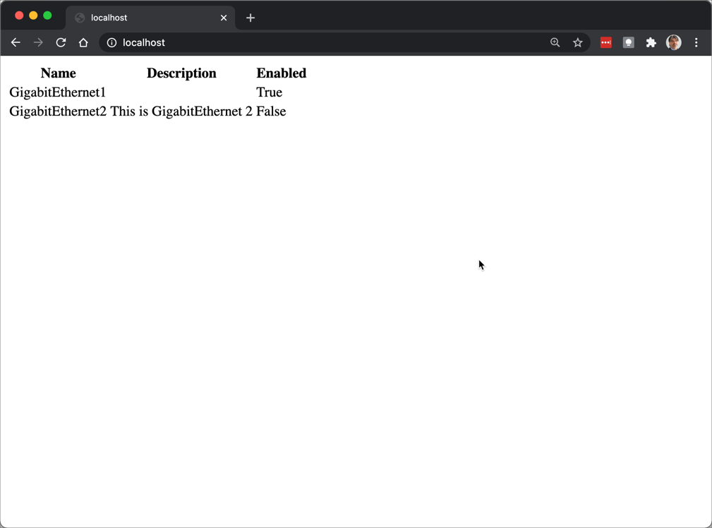

Step 2: Update View
###################

Now let’s update our interfaces/views.py to use the initial template:

.. literalinclude:: reference/views.py
    :caption: interfaces/views.py
    :language: python
    :linenos:
    :emphasize-lines: 2,11-15

Head back to your browser and refresh the page.
You should now see the device's interfaces in the form of an HTML table.

.. sectionauthor:: Luis Rueda <lurueda@cisco.com>, Jairo Leon <jaileon@cisco.com>, Ovesnel Mas Lara <omaslara@cisco.com>
